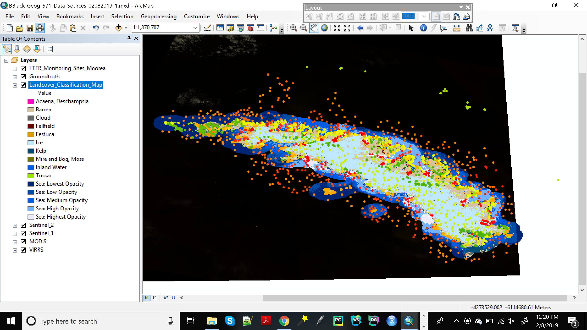

**Project Introduction**

I intend to create a website revolving around the NRT fellowship project I am involved with this year that is focused on investigating the impact of anthropogenic nutrients on the health of Mo’orea (French Polynesia) coral systems. I plan to post initial landcover classification maps of the island on this site, along with background information describing both the region and context of our NRT project. Since our NRT group has discussed creating a website for our project, I intend to keep in mind that this site will likely be expanded (both in scope and to include other student’s project work) over the next few months as I produce the website’s design.
** **
**Data Sources**

|Name|Description|Data Source|
|:---|:---:|:---:|
|LTER Monitoring Sites|Display longterm environmental research (LTER) sites at Mo'orea|http://mcr.lternet.edu/data|
|Groundtruth Points|Hand digitized points representing landcover types|OSU Mo'orea NRT Team|
|Landcover Classification Script|Object-based random forest classification based on script run through Google Earth Engine|https://code.earthengine.google.com/5f7f30ec85b995084bf60f651bb9f489 (code source)|
|Sentinel 2 Imagery|10 m (visible bands) spatial resolution, open-access satellite imagery with temporal resolution of ~ 5 days.|COPERNICUS/S2 (Image collection ID in Google Earth Engine)|
|GRD Sentinel 1 Imagery| 5X20m (IW mode) spatial resolution, open-access satellite imagery with temporal resolution of ~ 12 days|COPERNICUS/S1_GRD (Image collection ID in Google Earth Engine)|
|MODIS|250-500m spatial resolution (visible and NIR), open access satellite imagery with temporal resolution of 1-2 days|MODIS/006/MODOCGA (Image collection ID in Google Earth Engine)
|VIIRS| ~750m spatial resolution, open-access satellite imagery with temporal resolution of ~1 day|NOAA/VIIRS/001/VNP09GA (Image collection ID in Google Earth Engine)|
|Tier 1 Landsat 8 (potentially)|30 m (visible) spatial resolution, open-access satellite imagery with temporal resolution of ~ 16 days| LANDSAT/LC08/C01/T1_RT (Image collection ID in Google Earth Engine)|
** **
**Potential Datasets Image**
The following is a screen capture image of an ArcMap project displaying a similar suite of data to that proposed for the Mo'orea project, and is derived from a comparable ongoing project at South Georgia Island.

